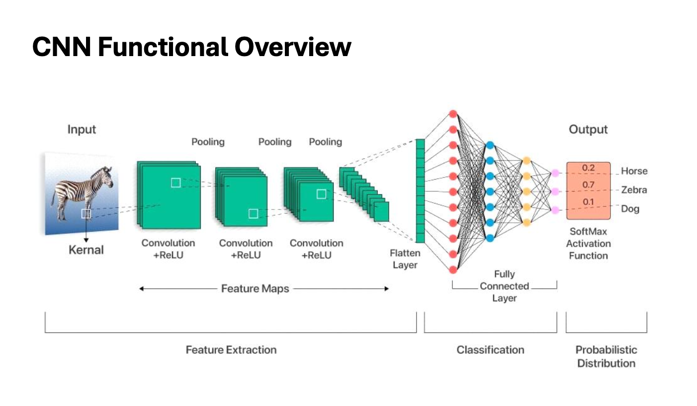
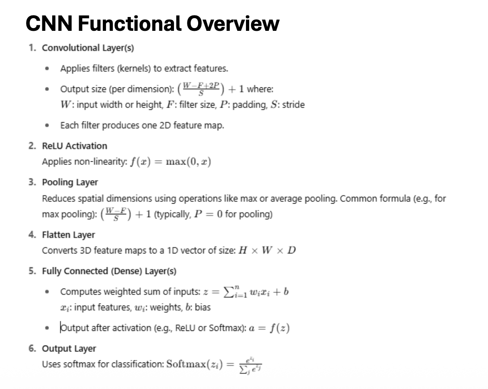
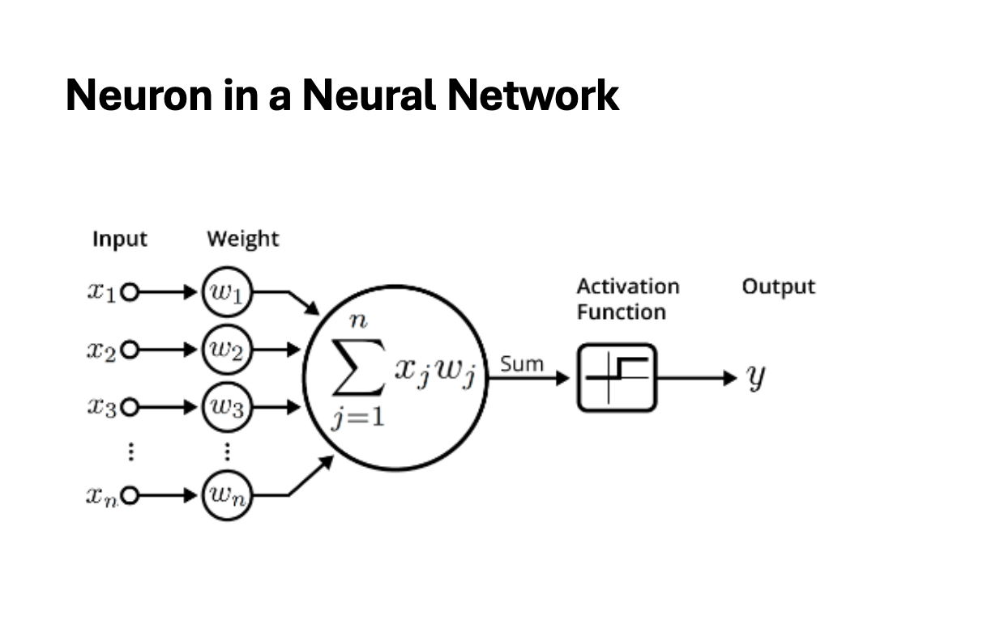
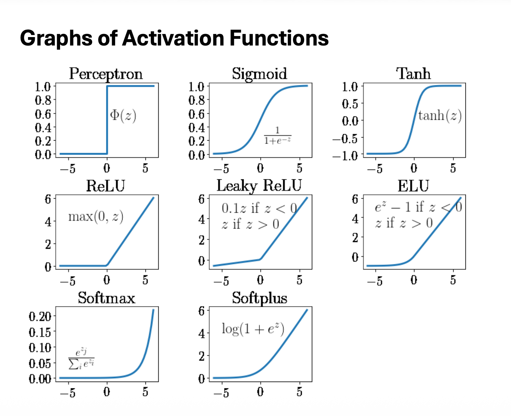

# Activision Function

`An Activation Function` is a mathematical formula applied to a neuron's output to introduce non-linearity into a neural network

Without them, stacking multiple layers would just equal a giant linear regression model (\(Y = XW + b\)), making it impossible for the model to learn complex patterns like shapes in computer vision or structures in text.

<br/>

## Key Activation Functions

| Function | Formula | Primary Use Case / Properties |
| :--- | :--- | :--- |
| **Sigmoid** | \(f(x) = \frac{1}{1 + e^{-x}}\) | Squashes values between 0 and 1; used for binary classification outputs. |
| **ReLU** | \(f(x) = \max(0, x)\) | Clips negatives to 0; default for hidden layers due to speed and efficiency. |
| **Tanh** | \(f(x) = \tanh(x)\) | Squashes values between -1 and 1; zero-centered data helps faster optimization. |
| **Softmax** | \(f(x) = \frac{e^{z_i}}{\sum e^{z_j}}\) | Normalizes a vector into probabilities that sum to 1.0; multi-class classification. |
| **Perceptron** | \(f(x) = \begin{cases} 1 & \text{if } x \geq 0 \\ 0 & \text{otherwise} \end{cases}\) | Rigid binary step function; historical value, not used in modern gradient descent. |
| **Leaky ReLU** | \(f(x) = \begin{cases} x & \text{if } x \geq 0 \\ \alpha x & \text{if } x < 0 \end{cases}\) | Adds a tiny slope to negative inputs; fixes the "Dying ReLU" problem. |
| **ELU** | \(f(x) = \begin{cases} x & \text{if } x > 0 \\ \alpha(e^x - 1) & \text{if } x \leq 0 \end{cases}\) | Smooth curve for negative values; speeds up deep network convergence. |
| **Softplus** | \(f(x) = \ln(1 + e^x)\) | Smooth, continuous curve approximation of ReLU; differentiable everywhere. |

<br/>

## How They Fit in a Neuron's Pipeline

```pwd
[ Input Data ] ──> ( 1. Linear Operation: z = Wx + b ) ──> ( 2. Non-Linear Operation: a = ReLU(z) ) ──> [ Output ]
```





---



---
