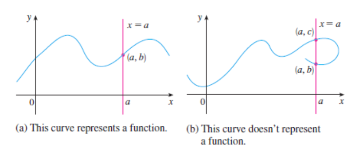

# Functions

`A function is a a specific rule that takes an input, processes it, and returns exactly one unique output`



<br/>

In AI, functions are used to:
̶  Transform inputs
̶  Model relationships
̶  Activate neurons
̶  Make decisions

<br/>

## Core Components

`The Input (Domain)`: The set of all possible starting values you can feed into the function. This is typically represented by the variable \(x\) (the independent variable).

`The Rule (The Process)`: The actual mathematical operation that transforms the input.

`The Output (Range)`: The resulting values that come out of the function. This is represented by \(y\) or \(f(x)\) (the dependent variable, read aloud as "f of x").

```pwd
 Input (x) ───> [ Function f(x) ] ───> Output (y)
```

<br/>

## The Golden Rule of Functions

For an equation to be a true function, one input can only map to exactly `one output`.

`Valid Function`: Inputting \(x = 2\) always gives you \(y = 4\).

`Not a Function`: Inputting \(x = 2\) sometimes gives you \(y = 4\) and sometimes gives you \(y = 5\).

In programming terms, a mathematical function must be a pure function—it must be completely deterministic.

<br/>

## Concrete Examples

#### Linear Function (A Straight Line)

**Equation**: \(f(x) = 2x + 3\)

**The Rule**: Take the input, multiply it by 2, and then add 3.

**Evaluation**: If your input is \(x = 4\), then \(f(4) = 2(4) + 3 = 11\).

<br/>

#### Non-Linear Function (A Curve)

**Equation**: \(f(x) = x^2\)

**The Rule**: Take the input and multiply it by itself.

**Evaluation**: If your input is \(x = -3\), then \(f(-3) = (-3)^2 = 9\).

<br/>

## How Functions Look in Code

Because you are an engineer, the easiest way to internalize a mathematical function is to see it as a Python function:

| Mathematical Notation | Python / NumPy Implementation |
| :--- | :--- |
| \(f(x) = 2x + 3\) | `def f(x): return 2 * x + 3` |
| \(f(x) = x^2\) | `def f(x): return x ** 2` |
| \(f(x) = \max(0, x)\) | `def relu(x): return np.maximum(0, x)` |

<br/>

## Why This Matters in AI/ML

In machine learning, your entire goal is to build or discover a massive, complex mathematical function.

**The Input (\(x\))**: Your data features (e.g., historical house data, image pixels, or text tokens).

**The Function (\(f\))**: The neural network or ML model, which contains weights and biases.

**The Output (\(y\))**: The model's prediction (e.g., house price, object classification, or the next word).

Training a model is simply the process of tweaking the internal math rules of \(f(x)\) until the outputs match reality.

<br/>

## Activision Function

[Read More](./activision.md)
