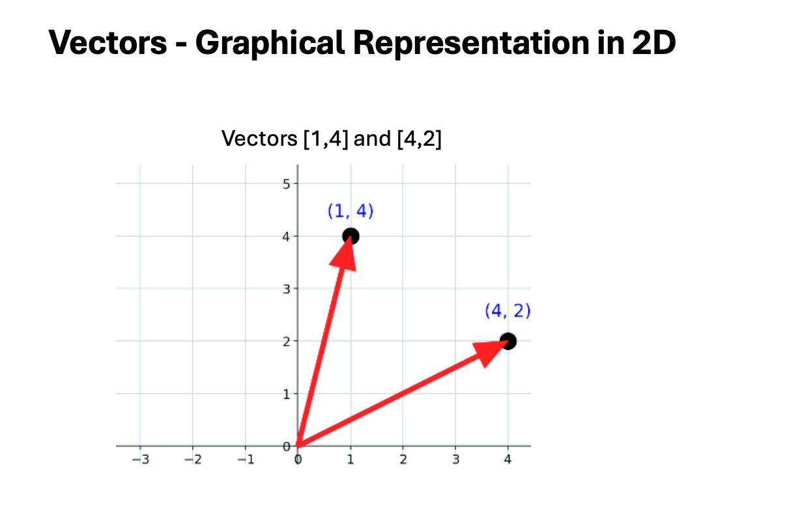
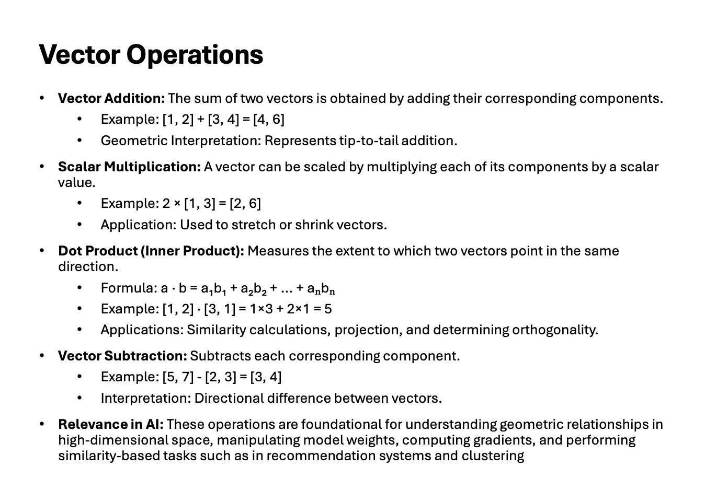
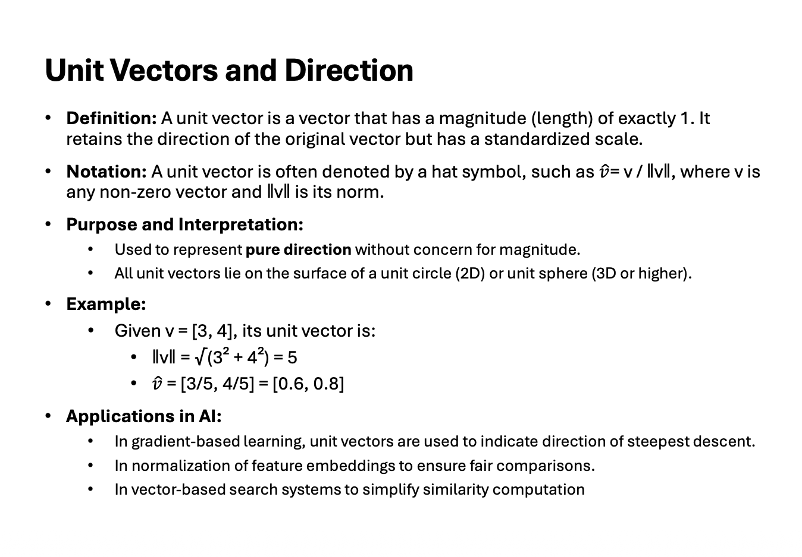
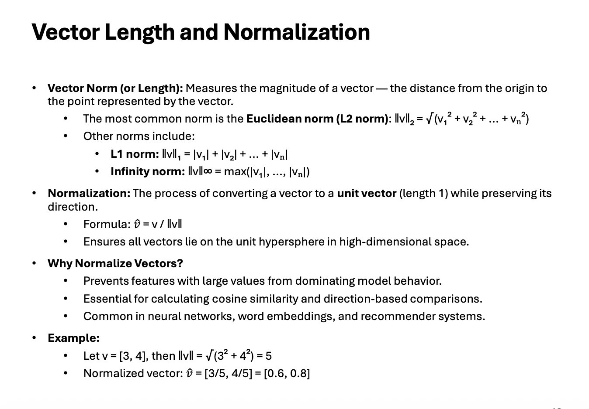
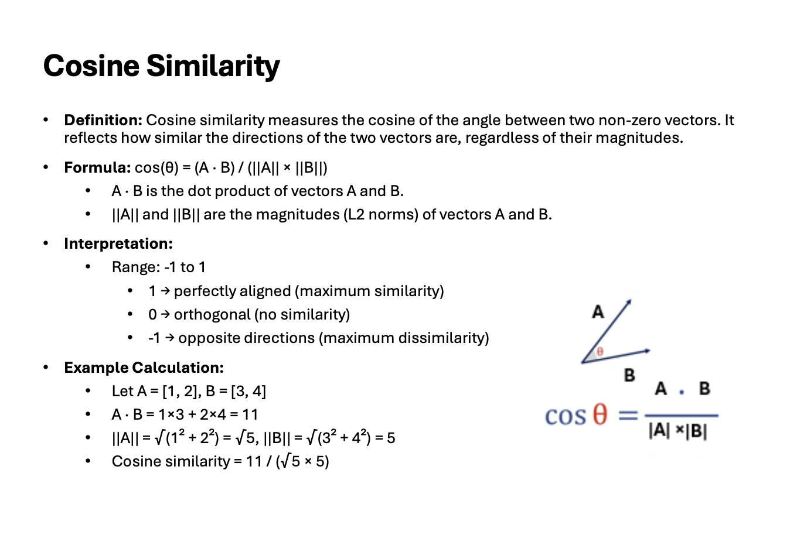

# Vectors

`A Vector` is a mathematical object consisting of an ordered sequence of
numbers, used to represent both magnitude and direction. Vectors are foundational in
artificial intelligence for encoding data, inputs, and model parameters.

`Usage in AI`: Vectors are used throughout AI and ML to represent data points,
model weights, and feature embeddings.

 

**🏢 Real-World Examples**

🧭 Velocity: Traveling at \(60\text{ mph}\) due North (combines speed and direction).
📍 GPS Coordinates: A position on a map represented as \([\text{Latitude}, \text{Longitude}]\).
📐 Force: Pushing an object with \(10\text{ Newtons}\) of force downward.
📦 Dimensions: The measurements of a box written as \([\text{Length}, \text{Width}, \text{Height}]\).

 

**🤖 AI / Machine Learning Examples**

🖼️ Image Pixel Data: A list of color intensities representing a gray-scale image, like \([255, 128, 0]\).
🏠 Feature Vector: A single sample containing house attributes, such as \([1200\text{ sqft}, 3\text{ rooms}, 2\text{ baths}]\).
⚖️ Layer Weights: A set of weights inside a neural network neuron, like \(\vec{w} = [0.4, -0.6, 0.8]\).
🔤 Word Embeddings: High-dimensional vectors used to capture semantic meaning (e.g., the word "King" represented as a dense array of hundreds of floating-point values).

---

---

